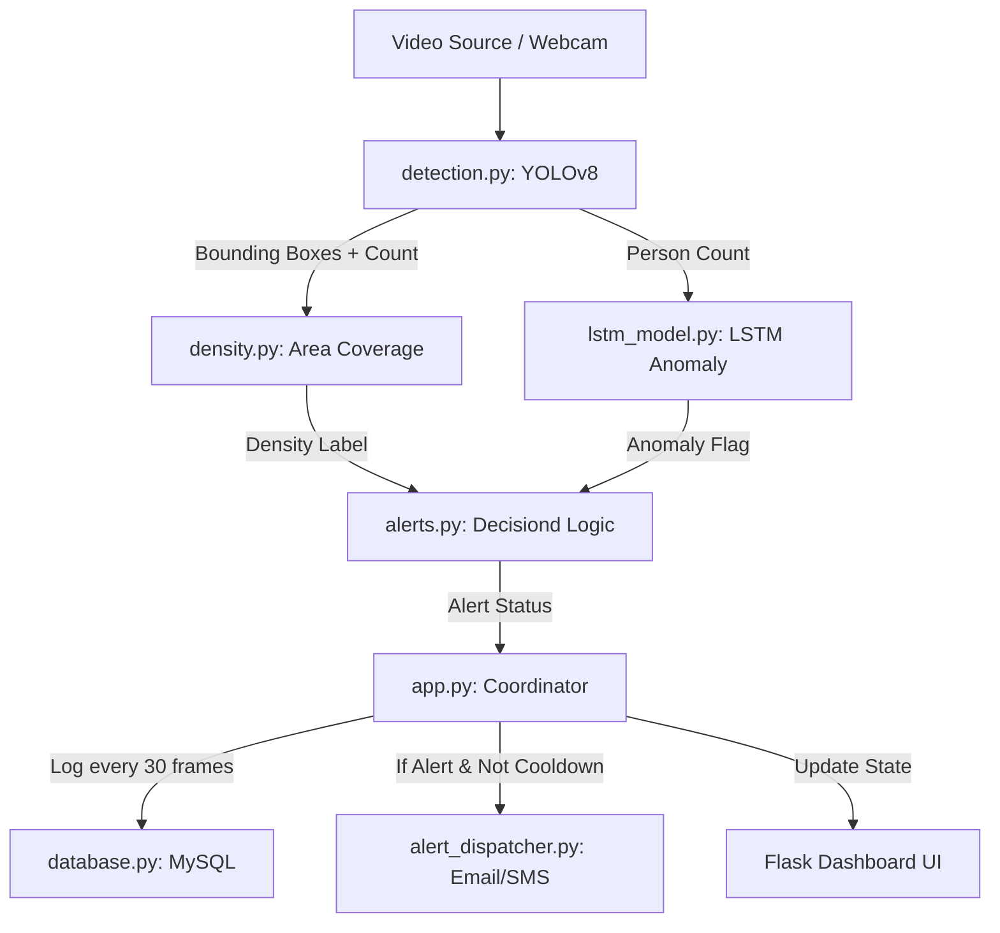

# Crowd Monitor System Architecture

This document explains the end-to-end workflow and the internal logic of the Crowd Monitor AI system.

## 1. System Overview
The system is designed to detect crowd density levels and sudden anomalies in real-time using computer vision and deep learning. It provides a web dashboard, logs historical data to MySQL, and dispatches alerts via Email and SMS.

## 2. Core Workflow (Data Pipeline)

## 3. Component Details

### A. Detection (`detection.py`)
- **Engine**: Ultralytics YOLOv8 (Nano version for speed).
- **Function**: Processes every frame to detect objects in the `person` class.
- **Output**: Returns the visually annotated frame, the total count, and a list of bounding box coordinates `(x1, y1, x2, y2)`.

### B. Density Analysis (`density.py`)
- **Method**: Area-based coverage.
- **Logic**: Instead of just counting heads, it calculates the **Total Area of Bounding Boxes / Total Frame Area**.
- **Classification**:
    - **Low**: < 10% coverage.
    - **Medium**: 10% - 30% coverage.
    - **High**: > 30% coverage.
- **Benefit**: Accurately accounts for people standing close to the camera (higher risk/density) versus people far away.

### C. Anomaly Detection (`lstm_model.py`)
- **Engine**: TensorFlow/Keras LSTM.
- **Logic**: 
    1. Maintains a history of the last 10 counts.
    2. Predicts what the *next* count should be based on previous patterns.
    3. If the reality exceeds the prediction by a Z-score threshold (residual > 2.0), it flags a "Spike Anomaly".
- **Threshold**: Only runs if count >= 3 to avoid false alerts in empty rooms.

### D. Alert Decision Logic (`alerts.py`)
- **Logic**: Filters noise to prevent over-alerting.
- **Rules**:
    - **Trigger Alert if**: (Density is High) **OR** (Density is Medium AND an LSTM Anomaly exists).
    - **Ignore if**: Density is Low (even if an anomaly is detected).

### E. Dispatcher & Cooldown (`alert_dispatcher.py`)
- **Channels**: SMTP (Gmail) and Twilio (SMS).
- **Persistence**: Remembers the last sent time in `/tmp/email_cooldown.json`.
- **Cooldown**: 300 seconds (5 minutes) between notifications to prevent spamming.

### F. Database (`database.py`)
- **Storage**: MySQL.
- **Schema**: Logs timestamp, person count, density ratio, labels, and alert messages.
- **Optimization**: Logs only every 30 frames to save database bandwidth.

## 4. How to Use
1. **Configure `.env`**: Add your database, SMTP, and Twilio credentials.
2. **Run the app**: `python app.py`.
3. **View Dashboard**: Open `http://localhost:5000`.
4. **Public Demo**: Scan the QR code in the terminal to view on mobile via Ngrok.
