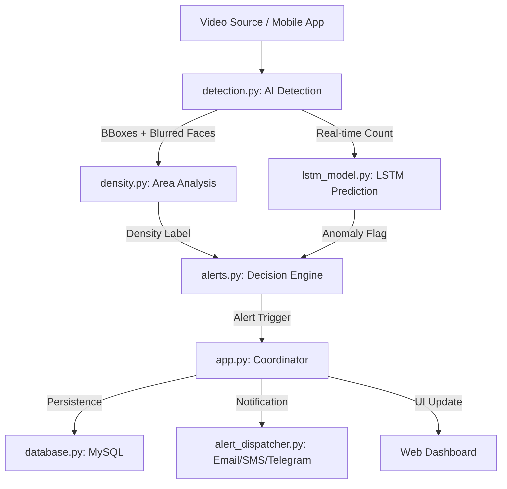

# 🚀 Crowd Monitor — Distributed AI Monitoring System

Crowd Monitor is an end-to-end, high-performance monitoring solution that leverages **YOLOv8** for real-time detection, **LSTM neural networks** for anomaly prediction, and a **Distributed Capture System** that transforms any smartphone into a wireless camera feed.


---

## 🌟 Key Features

- **📡 Distributed Capture**: Scale your monitoring instantly. Use the `/capture` route to turn any smartphone into a remote camera feed via WiFi/Mobile data.
- **👁️ Intelligent Detection**: 
  - **YOLOv8 Engine**: Precise person detection and counting.
  - **Zone-Based Analysis**: Tracks crowd movement across **Entry, Center, and Exit** zones.
  - **Privacy First**: Automated **Face Blurring** using Haar cascades to ensure data privacy.
- **📉 Advanced Analytics**:
  - **Area-Based Density**: Calculates true density based on physical frame coverage (Low/Medium/High).
  - **LSTM Anomaly Detection**: Deep learning model that identifies "spontaneous gatherings" by detecting statistical spikes in crowd flow.
- **🚨 Multi-Channel Alerts**:
  - **Telegram**: Instant notifications via Bot API.
  - **Email**: Detailed alerts sent via SMTP.
  - **Audio**: Siren/Beep indicators on the web dashboard.
  - **Smart Cooldown**: 5-minute persistent cooldown to prevent notification spam.
- **📊 Interactive Dashboard**:
  - Real-time **Chart.js** line graphs for population tracking.
  - **Snapshots**: Access a gallery of the last 5 high-priority alerts.
  - **Peak Tracking**: Daily logs of maximum crowd capacity with timestamps.

---

## 🛠️ Technology Stack

| Component | Technology |
|---|---|
| **Backend** | Python 3, Flask |
| **Computer Vision** | OpenCV, Ultralytics YOLOv8 |
| **Deep Learning** | TensorFlow / Keras (LSTM) |
| **Database** | MySQL |
| **Frontend** | HTML5, Vanilla CSS, JS (Chart.js) |
| **Connectivity** | Ngrok (for Public URLs & QR Access) |

---

## 📂 Project Structure

```bash
crowd_monitor/
├── app.py              # Main Flask server & Route Coordinator
├── detection.py        # YOLOv8 Person Detection & Face Blurring
├── density.py          # Area-based Density Calculation
├── lstm_model.py       # Online LSTM Anomaly Detection
├── alerts.py           # Core Business Logic for Alert Priorities
├── database.py         # MySQL Persistence & Logging
├── telegram_alert.py   # Telegram Integration
├── alert_dispatcher.py # Email & SMS (Twilio) support
└── requirements.txt    # Dependency list
```

---

## 🚀 Getting Started

### 1. Prerequisites
- Python 3.9+
- MySQL Server

### 2. Installation
```bash
# Clone the repository
git clone https://github.com/Jebaprakash/Crowd-Monitor.git
cd Crowd-Monitor

# Create and activate virtual environment
python3 -m venv .venv
source .venv/bin/activate  # On Windows: .venv\Scripts\activate

# Install dependencies
pip install -r requirements.txt
```

### 3. Configuration
Create a `.env` file in the root directory:
```env
# Database Config
DB_HOST=localhost
DB_USER=root
DB_PASS=your_password
DB_NAME=crowd_monitor

# Alert Recipients
ALERT_TO=+910000000000
EMAIL_TO=recipient@example.com

# Messaging Credentials
SMTP_USER=your_email@gmail.com
SMTP_PASS=your_app_specific_password
TELEGRAM_TOKEN=your_bot_token
TELEGRAM_CHAT_ID=your_chat_id
TWILIO_ACCOUNT_SID=sid
TWILIO_AUTH_TOKEN=token
TWILIO_PHONE_NUMBER=phone
```

### 4. Database Setup
The system will automatically initialize tables on first run, but you must create the database first:
```sql
CREATE DATABASE crowd_monitor;
```

---

## ⚙️ Usage

1. **Start the Application**:
   ```bash
   python app.py
   ```
2. **Access the Dashboard**: Open `http://localhost:5000`.
3. **Connect Remote Cameras**: 
   - Scan the **QR Code** printed in the terminal.
   - On the mobile device, navigate to `/capture` to start streaming frames to the AI engine.

---

## 🗺️ System Architecture



---

## 📝 License
This project is for educational and monitoring purposes. View the `PROJECT_DETAILS.md` for more technical specifics.
